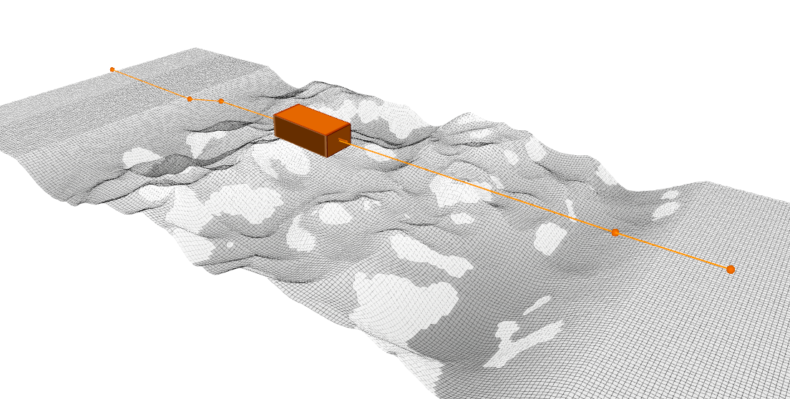
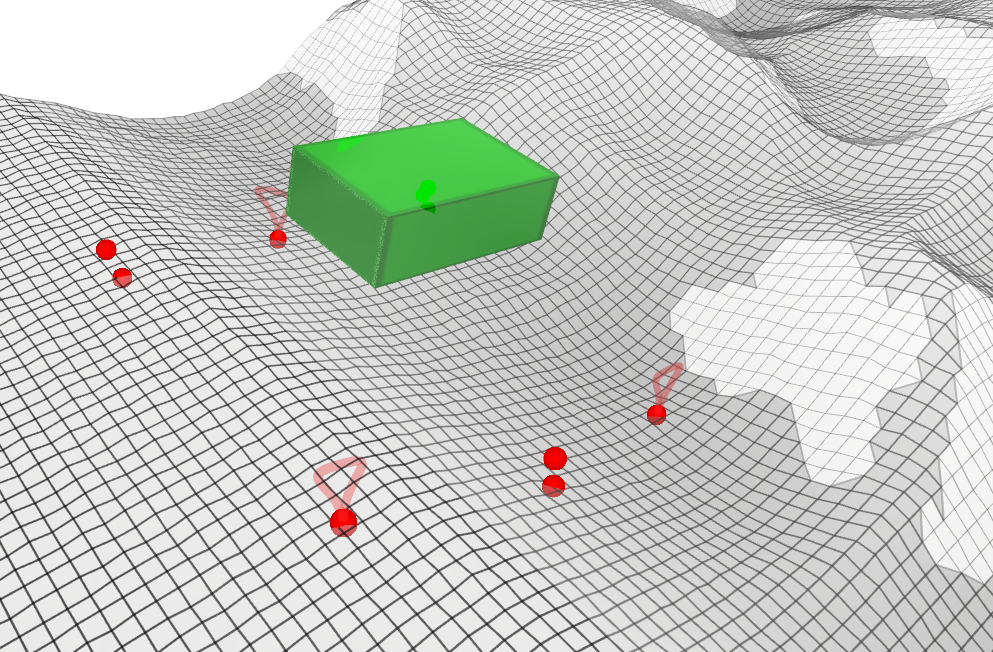

# Project Hexapod201

## Installation

Clone the repository:

```bash
# Under catkin_ws
git clone --recursive https://github.com/MasterYip/FLTPlanner.git
mv FLTPlanner src
cd src
git submodule update --init --recursive
```

Install apt dependencies:

```bash
sudo apt install \
ros-$ROS_DISTRO-ros-industrial-cmake-boilerplate \
ros-$ROS_DISTRO-costmap-2d \
ros-$ROS_DISTRO-octomap \
ros-$ROS_DISTRO-ompl \
ros-$ROS_DISTRO-pcl-ros \
python3-catkin-tools \
qtbase5-dev \
libglpk-dev
```

Install cddlib manually:

```bash
# Under catkin_ws/src
cd ./legged_traj_planner/third_party
tar -xvf cddlib-0.94m.tar.gz
cd cddlib-0.94m
./configure
make
sudo make install
```

Build the package:

> [!WARNING]
> **DO NOT** install `ros-noetic-grid-map`, `ros-noetic-hpp-fcl` and `ros-noetic-pinocchio` from apt, which will lead to unexpected error.
> Recommand jobs of `catkin build -j16`
> | Jobs | Time Est. | Min Mem. |
> |------|----------|-----------------|
> | -j4 | 32min | 16 GB |
> | -j8 | 16min | 24 GB |
> | -j16 | 8min | 32 GB |
> | -j32 | 4min | 48 GB |

```bash
# Under catkin_ws
catkin build legged_traj_plan_examples legged_traj_search_examples robot_assets -DCMAKE_BUILD_TYPE=RelWithDebInfo # Release
source ./devel/setup.bash
```

### Problem Shooting

1. Undefined reference to 'grid_map::GridMap::add()'
    - If you encounter this error, it may be due to the `grid_map` library is linked incorrectly. Make sure you have already uninstall the ros version of `grid_map`: `sudo apt remove ros-noetic-grid-map-*`


## Get Started

Install pyads for PLC communication:

```bash
pip install pyads
```

Python interface (Base motion only):



```bash
roslaunch legged_traj_plan_examples hexapod201_state_sequence_planner.launch \
robot_interface_type:=Hexapod201Dummy \
sim:=true \
teleop_type:=keyboard \
demo_name:=6_fractal \
planner_cfg:=height_clear_planner \
use_pyinterface:=true
```

Cpp Dummy interface (Base motion & Foothold):



```bash
roslaunch legged_traj_plan_examples hexapod201_state_sequence_planner.launch \
robot_interface_type:=Hexapod201Dummy \
sim:=true \
teleop_type:=PS5 \
demo_name:=6_fractal \
planner_cfg:=height_clear_planner \
use_pyinterface:=false
```